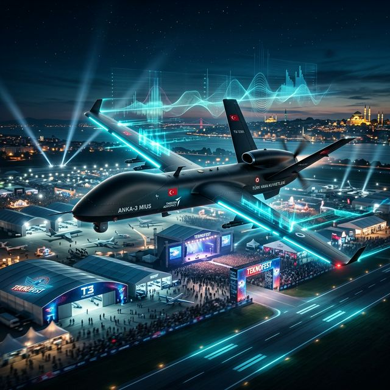

# 📡 Otonom Elektronik Harp Sistemi (Cognitive-EW-Suite) v3.0




**Otonom Elektronik Harp Sistemi (Cognitive-EW-Suite)**, modern elektronik harp (EH) ve elektromanyetik spektrum operasyonlarında (EMSO) Derin Öğrenme (Deep Learning) ve Pekiştirmeli Öğrenme (Reinforcement Learning) metodolojilerini spektral analiz süreçlerine entegre eden otonom bir Bilişsel Elektronik Harp (Cognitive EW) platformudur.

Sistem, Statik Tehdit Kütüphanelerine (Emitter Threat Library) dayalı klasik Karşı Tedbir (ECM) yaklaşımlarının aksine; stokastik spektral anomalileri dinamik olarak anlamlandırabilen, non-lineer hedef tespit-takip korelasyonu kurabilen ve OODA (Gözlem, Yönelim, Karar, Eylem) döngüsünün insan faktörü olmaksızın milisaniyeler içerisinde tamamlanmasını sağlayan otonom ajan (autonomous agent) mimarisine dayanmaktadır.

---

## 🏛️ Yönetici Özeti: Elektronik Harpte Yapay Zeka Paradigması

Gelişen LPI (Low Probability of Intercept) radarları, yazılım tanımlı radyolar (SDR) ve bilişsel frekans atlamalı (Frequency Hopping) haberleşme dalga şekilleri, eylemsiz, donanım-sabiti, kural tabanlı (Rule-Based) karıştırma (Jamming) ve aldatma (Spoofing) tekniklerini asimetrik harekat ortamında zafiyete uğratmıştır. Düşman elektronik harp aygıtlarının spektrum üzerindeki kaçış, gizlenme ve adaptasyon paternlerini kestirebilmek için deterministik algoritmalar çökmüş; varyans analizi ile beslenen **Yapay Zeka (AI)** tabanlı karar-destek ve komuta kontrol (C2) sistemleri operasyonel bir zorunluluk haline gelmiştir.

Bu araştırma / prototip projesi, Elektronik Destek (ES) ile tespit edilen elektromanyetik vektörleri, Bilgisayarlı Görü (Computer Vision) ile spektral öznitelik haritalarına çevirmeyi, PyTorch Çok Katmanlı Algılayıcı (MLP) modülleriyle modülasyon tespiti yapmayı ve Markov Karar Süreçleri'ni (MDP) modelleyen Q-Learning ajanı vasıtasıyla Elektronik Taarruz (EA) "Look-Through" parametrelerini optimum efektif noktaya taşımayı, reaksiyon süresini $<100ms$ aralığına düşürerek hedefler.

---

## 🧠 Bilişsel Mimari ve Yapay Zeka Entegrasyonu

Sistem, elektromanyetik spektrumdaki sinyal tespiti, sınıflandırma ve taarruz optimizasyonu görevlerini birbirinden bağımsız çalışan, ancak eşgüdümlü karar alan üç ana AI/ML işlem bloğuna ayırmıştır:

### 1. Spektral Görü İşleme ve Anomali Tespiti (Computer Vision)
Klasik enerji tabanlı eşik (Threshold) tespiti yerine spektrum, 2 boyutlu bir zaman-frekans şelalesi (Waterfall Spectrogram) olarak analiz edilir.
- **OpenCV & Canny Edge Algoritmaları:** SDR modülünden akan PSD (Power Spectral Density) verileri `uint8` gri tonlamalı imaj matrislerine dönüştürülür.
- **Sinyal Morfolojisi Analizi:** Sistem, `cv2.findContours` fonksiyonları kullanılarak atmosferik solma (Atmospheric Fading) ve çevresel gürültünün yarattığı dezenformasyon filtreleyerek sinyal adacıklarının (blobs) merkez frekansını, bant genişliğini ve SNR marjını otonom olarak hesaplar.

### 2. PyTorch Tabanlı Derin Sınıflandırma Ağları (Deep Learning)
Tespit edilen bir sinyalin modülasyon tipini (BPSK, QPSK, 16QAM, FMCW, LoRa vb.) kestirmek için istatistiksel kurallar yerine **PyTorch** mimarisi kullanılarak Çok Katmanlı İleri Beslemeli Yapay Sinir Ağı (MLP - Multi-Layer Perceptron) devreye sokulur.
- **Tensör Ağ Yapısı:** Sinyalin bant genişliği (BW) ve sinyal-gürültü oranı (SNR) normalize edilmiş tensör girdileri olarak `Linear(2, 16) -> ReLU -> Linear(16,8) -> ReLU -> Linear(8, Classes)` zinciri boyunca ileri yönlü (Forward-Pass) işlenir.
- **Esnek Reaksiyon:** Ağ, klasik sistemlerin yanıldığı geniş bantlı ancak sönük (Faded) LPI sinyallerinin tanınmasında yüksek başarım göstermek üzere konfigüre edilmiştir.

### 3. Pekiştirmeli Öğrenme (Reinforcement Learning) ve Adaptif Elektronik Taarruz
Projenin temel otonomi unsuru olan Q-Learning adaptasyonu, Elektronik Destek (ED) ve Elektronik Taarruz (ET) arasındaki körleşmeyi (Blind-Spot) minimuma indirgemeyi hedefler. Algoritma "Ara Başık" (Look-Through) tekniğini optimize eder.
- **Dinamik Ödül/Ceza (Reward System):** ET (Karıştırma) esnasında ajan (Agent), uyguladığı taarruz sonrası spektrumdaki hedef sayısında bir düşüş algılarsa $(+10)$ ödül puanı alır. Hedefin gücü düşmezse, yani hedefin frekans atlatarak kaçtığı tespit edilirse ajan enerji israfı nedeniyle $(-5)$ puanlık ceza ile cezalandırılır.
- **Taarruz Kavraması:** Otonom ajan, zamanla hangi hedef profilinde ne kadar süre $T_{jam}$ (Karıştırma) ve $T_{look}$ (Dinleme) yapması gerektiğini öğrenerek "Optimum Duty Cycle" oranına yakınsar.

### 4. Non-Linear State Estimation (Kalman Filtresi) ve RFI Parmak İzi
Tespit edilen elektromanyetik tehdit profilleri, anlık Geliş Açısı (AoA) spekülasyonlarından sıyrılıp, uzamsal bir takip algoritması ile korelasyona sokulur.
- **Track-While-Scan (Kalman Tracker):** Spektral sıçrama ve kros-modülasyon uygulayan hedeflerin uzamsal-frekans (Spatial-Spectral) özniteliklerini izafi bir durum vektörü (State Vector / Track ID) içinde entegre eder ve hedef sürekliliğini teminat altına alır.
- **Radio Frequency Fingerprinting (RFI):** Sinyal Üreticilerindeki donanımsal osilatör toleranslarının (Phase Noise, Phase Jitter, Carrier Offset) yarattığı benzersiz nano-akustik sapmaları işleyerek deterministik Kriptografik Karma (Hash Signature) üretir. Bu özellik PyTorch modülünü bypass ederek, aynı kimliğe (örn: BPSK) ve banda sahip muharip cihazların eşsiz dijital imzalarla radarda izole edilmesine imkan verir.

---

## 🧮 Alt Sistemler ve Taktik Destek Unsurları

### Zaman Farkı (TDOA) ile Otonom Yön Bulucu (DF)
Hedefin geliş açısı (Angle of Arrival - AoA), birden fazla karşılama anteni (Antenna Array) simülasyonu üzerinden, sinyallerin varış zamanı farkları (TDOA) ölçülerek hesaplanır. 
Gerçek bir savaş alanı simülasyonu sağlamak için hedefin bulunduğu ideal açı değerinin üzerine $\mu=0, \sigma=2.0$ varyansına sahip Gaussian White Noise (Beyaz Gürültü) eklenir. Sistem, Radar (Polar) ekranında bu bulanıklaşmış hedefe kilitlenme işlemi uygular.

### Taktik Görev Veri Kaydedicisi (SQLite Blackbox)
Sistemin sensörlerinin tespit ettiği her anomali ve RL Ajanının aldığı her karıştırma/bekleme (Jamming/Standby) kararı asenkron mimari ile `sqlite3` tabanlı `mission_log.db` görev bilgisayarına kaydedilir. Bu veritabanı, görevin sonlanmasının ardından EH subayları ve istihbarat birimleri tarafından Görev Sonu Kritik Analizi (AAR - After Action Report) için yapılandırılmıştır.

---

## 💻 Siber Operatör Komuta Merkezi (C2 Dashboard)
Salt otonom bir yapay zeka yerine "Human-on-the-loop" (İnsan Denetiminde Kontrol) felsefesi benimsenmiştir. Flask-SocketIO üzerinden beslenen ve saniyede 10 kare hızında akış sağlayan komuta arayüzü aşağıdaki modülleri içerir:

1.  **Dinamik Waterfall Spektrogrami:** HTML5 Canvas nesnesi ile `uint8` veri bloklarının 2 boyutlu Siber-Neon skalaya dönüştürülmüş anlık akışı.
2.  **TDOA Polar Savaş Radarı (Chart.js):** Sinyallerin AoA dağılımlarını Kutupsal (Polar) Gülgoncası haritası üzerinde görselleştirir.
3.  **Gerçek Zamanlı Q-Ödül Grafiği:** Ajanın o an uyguladığı karıştırma algoritmalarından sağladığı başarılı/başarısız geri bildirim döngüsünü zamana bağlı çizer.
4.  **Operatör Override (Müdahale) Paneli:** Kullanıcı, tek bir tıklamayla Otonom Yapay Zekayı devreden çıkarıp MANUEL yetkiyi alabilir; karıştırma görevlerini ve çevresel RF spektrum gürültü eşiğini (Noise Floor) $(-120dB)$ ila $(-40dB)$ arasında anlık tahsis edebilir.
5. **AAR Görev Raporu:** Her görevin ardından, "AAR RAPORUNU İNDİR" butonuyla tüm `Track_ID`, `RFI_Hash`, `AoA` logları CSV formatında anlık raporlanır.

---

## 🛠️ Teknik Gereksinimler ve Kurulum

Proje, Derin Öğrenme, Sinyal İşleme ve Asenkron Web Haberleşmesi kütüphanelerinin eşgüdümlü birleşimini gerektirmektedir.

```bash
# Gerekli Taktik Sinyal, ML ve Ağ Paketlerinin Kurulumu
pip install -r requirements.txt eventlet

# Bilişsel EH Karar ve Destek Sisteminin Başlatılması
python main.py
```

### 🐳 Docker ile Otonom Başlatma (Production-Ready)
Sistem tüm bağımlılıklarıyla birlikte sanallaştırılmıştır. Kapsayıcıyı derleyip ayağa kaldırmak için:
```bash
docker-compose up --build -d
```

Sistem başlatıldığında `http://localhost:5000` adresinden TCP/WS tabanlı Komuta Kontrol Enstrüman Panelinize erişebilirsiniz.
Ağ analizi tamamlandıktan sonra operatör arayüzünden Görev Sonu Raporunu (AAR CSV) tek tıkla çekebilirsiniz.

---

## 🚀 Akademik Vizyon ve Nihai Otonomi
Bu proje, salt bir yazılım mimarisi değil, elektromanyetik spektrumda hayatta kalmanın sadece "Daha akıllı algoritmalarla" mümkün olacağını gösteren akademik bir vizyondur. İnsansız Hava Araçları (İHA) ve Otonom Kara Araçları (İKA) için GNU Radio / UHD (USRP Hardware Driver) uyumluluğu gözetilerek yazılmış bu iskelet, modüler yapısı sayesinde gerçek donanımlarla bir "Otonom Elektronik Harp Subayı" olarak işlev görme nihai hedefine (TRL-9) adaydır.